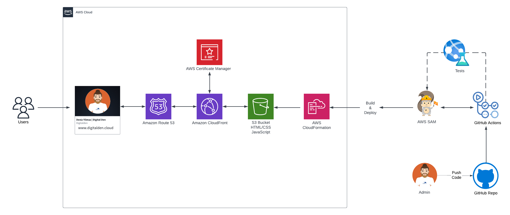

<br />

<p align="center">
  <a href="img/">
    
  </a>
  <h1 align="center">A Serverless Website</h1>
  <p align="center">
    This project was built on AWS and has a CI/CD pipeline on GitHub Actions workflow.
     <br />
    This is the front-end repo to the website:
    <br />
    https://digitalden.cloud
  </p>
</p>


</p>

<details open="open">
  <summary><h2 style="display: inline-block">Project Details</h2></summary>
  <ol>
    <li><a href="#tech-stack">Tech Stack</a>
    <li><a href="#project-date">Project Date</a></li>
    </li>
    <li><a href="#project-description">Project Description</a></li>
    <li><a href="#html-css">HTML / CSS</a></li>    
    <li><a href="static-s3-website">Static S3 Website </a></li>
    <li><a href="#https-and-dns">HTTPS and DNS </a></li>
    <li><a href="#github-actions">Github Actions</a></li>
    <li><a href="#javascript">JavaScript</a></li>
    <li><a href="#acknowledgements">Acknowledgements</a></li>
  </ol>
</details>

### Tech Stack
------------------
- HTML/CSS
- AWS S3
- AWS CloudFront
- Certificate Manager
- GitHub Actions
- JavaScript

### Project date
------------------
16.04-2023

### Frontend Architecture
------------------


### Project Description
------------------

The architecture was deployed by using the AWS Management Console and GitHub Actions was used for the CI/CD method.

I have recently made a dev branch and am currently working to automate this architecture with IaC (AWS SAM).

The backend of this project has been deployed by AWS SAM and can be found [HERE](https://github.com/digitalden3/serverless-website-backend).

### HTML / CSS
------------------ 
Built a simple landing page that hosts multiple links. Website is written in HTML and styled in CSS.

### Static S3 Website 
------------------
Created a S3 bucket and enabled bucket to host a static website. Uploaded index.html and stye.css (referenced in HTML) to the bucket.

### HTTPS and DNS 
------------------
Registered domain at digitalden.cloud. Configured Amazon Route 53 to route traffic to digitalden.cloud

Secured website using HTTPS protocol. Requested Public Certificates from AWS Certificate Manager. Configured a CloudFront distribution for root domain and subdomain. Updated A Records to route traffic to CloudFront distribution.

### Github Actions
------------------
This project has a CI/CD pipeline on GitHub Actions workflow. It automates the deployment of files to an S3 bucket and the invalidation of the corresponding CloudFront distribution cache:
 
 ```bash
name: Workflow for S3 Deploy and Invalidate Cache
on: [push]

jobs:
  deploy-and-invalidate:
    runs-on: ubuntu-latest
    steps:
    - name: checkout
      uses: actions/checkout@master

    # Upload to S3
    - name: sync s3
      uses: jakejarvis/s3-sync-action@master
      with:
        args: --exclude '.git*/*' --delete --follow-symlinks
      env:
        SOURCE_DIR: './'
        AWS_REGION: 'eu-west-2'
        AWS_S3_BUCKET: ${{ secrets.AWS_S3_BUCKET }}
        AWS_ACCESS_KEY_ID: ${{ secrets.AWS_ACCESS_KEY_ID }}
        AWS_SECRET_ACCESS_KEY: ${{ secrets.AWS_SECRET_ACCESS_KEY }}

    # Invalidate Cloudfront
    - name: invalidate
      uses: chetan/invalidate-cloudfront-action@master
      env:
        DISTRIBUTION: ${{ secrets.CLOUDFRONT_DISTRIBUTION_ID }}
        PATHS: '/*'
        AWS_REGION: 'eu-west-2'
        AWS_ACCESS_KEY_ID: ${{ secrets.AWS_ACCESS_KEY_ID }}
        AWS_SECRET_ACCESS_KEY: ${{ secrets.AWS_SECRET_ACCESS_KEY }}
 ```

The workflow is triggered by a push event and consists of a single job. The job checks out the code, uploads the files to the specified S3 bucket, and invalidates the CloudFront cache.


 The AWS access key and secret access key are obtained from GitHub secrets and are stored in Github Action Secrets rather than in code for security.

### Room For Growth
Automate the architecture with IaC. AWS SAM / Terraform.

### Acknowledgements
------------------
* [Cloud Resume Challenge](https://cloudresumechallenge.dev/)