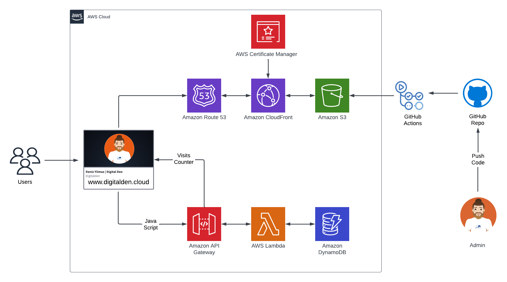

 

  
  <h1 align="center">A Serverless Website</h1>
  

    Built on AWS using ClickOps and GitHub Actions for CI/CD.
      
    This is the front-end repo to the website:
     
    https://digitalden.cloud
  

  
<h2 style="display: inline-block">Project Details</h2>

  <ol>
    <li><a href="#tech-stack">Tech Stack</a>
    <li><a href="#project-date">Project Date</a></li>
    </li>
    <li><a href="#project-description">Project Description</a></li>
    <li><a href="#aws-sam-cli">AWS SAM CLI</a></li>    
    <li><a href="#dynamodb">DynamoDB</a></li>
    <li><a href="#lambda-function">Lambda Function</a></li>
    <li><a href="#api-gateway">API Gateway</a></li>
    <li><a href="#javascript">JavaScript</a></li>
    <li><a href="#sam-local-invoke">SAM Local Invoke</a></li>
    <li><a href="#github-actions">Github Actions</a></li>
    <li><a href="#unit-testing">Unit Testing</a></li>
    <li><a href="#integration-testing">Integration Testing</a></li>
    <li><a href="#project-files">Project Files</a></li>
    <li><a href="#acknowledgements">Acknowledgements</a></li>
  </ol>

### Tech Stack
------------------
- HTML/CSS
- AWS S3
- AWS CloudFront
- Certificate Manager
- AWS Lambda
- Dynamo DB
- GitHub Actions
- Java Script

### Project Description
------------------

The architecture is deployed by using ClickOps and GitHub Actions as the CI/CD method.

The backend components of the website support a counter of visitors to the website.  The data (visitor count value) is stored in a DynamoDB database, which is accessed by a Lambda function written in Python3.  The function is accessed through a REST API created with API Gateway, which when called will invoke the Lambda function and forward back the direct response due to a “Lambda proxy” configuration.  Each time the page is loaded, a short JavaScript script utilizes Fetch API to ping the endpoint of the counter API, before rendering the response in the footer of the page.  

The website fetches and displays the latest visitor count, while the Lambda function handles incrementation as it interacted exclusively with the database.

### Project date
------------------
16.04-2023

### HTML/CSS
------------------ 
Wrote website as a HTML webpage and used CSS for styling.

### Static S3 Website 
------------------
Created a S3 bucket and enabled bucket to host a static website. Uploaded index.html and stye.css (referenced in HTML) to the bucket.

### 3. HTTPS & DNS 
Registered domain at digitalden.cloud. Configured Amazon Route 53 to route traffic to digitalden.cloud

Secured website using HTTPS protocol. Requested Public Certificates from AWS Certificate Manager. Configured a CloudFront distribution for root domain and subdomain. Updated A Records to route traffic to CloudFront distribution.

### 6. CI/CD
 Implemented a CI/CD pipeline using GitHub Actions. Once code is pushed to GitHub repo, GitHub Actions will be triggered which will sync all code to S3 bucket. 
 
 Added code that invalidates CloudFront cache.
 
AWS credentials are stored in Github Action Secrets rather than in code for security.

### 7. Room For Growth
Automate the front-end with IaC. AWS SAM / Terraform.