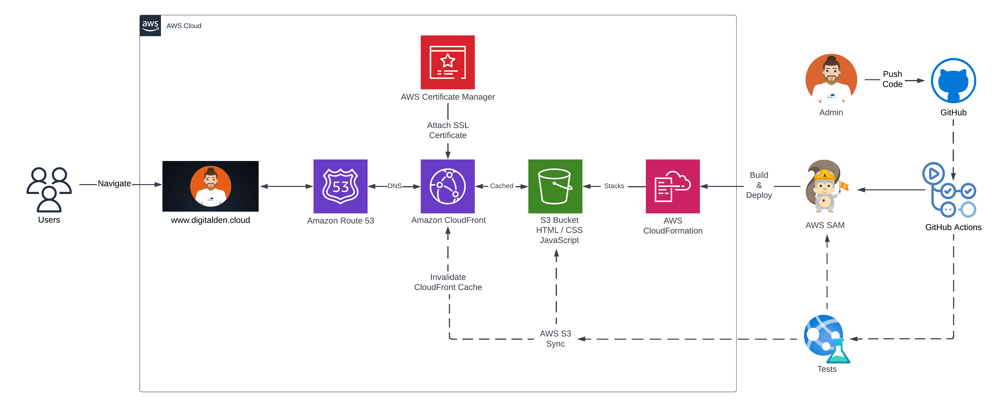
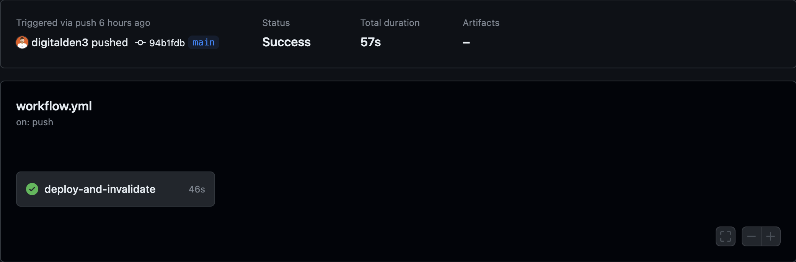

<br />

<p align="center">
  <a href="img/">
    
  </a>
  <h1 align="center">A Serverless Website</h1>
  <p align="center">
    This project was built on AWS and has a CI/CD pipeline on GitHub Actions workflow.
     <br />
    This is the front-end repo to the website:
    <br />
    https://digitalden.cloud
  </p>
</p>


</p>

<details open="open">
  <summary><h2 style="display: inline-block">Project Details</h2></summary>
  <ol>
    <li><a href="#tech-stack">Tech Stack</a>
    <li><a href="#project-date">Project Date</a></li>
    </li>
    <li><a href="#frontend-architecture">Frontend Architecture</a></li>
    <li><a href="#project-description">Project Description</a></li>
    <li><a href="#aws-sam-cli">AWS SAM CLI</a></li>  
    <li><a href="#html-css">HTML / CSS</a></li>    
    <li><a href="static-s3-website">Static S3 Website </a></li>
    <li><a href="#https-and-dns">HTTPS and DNS </a></li>
    <li><a href="#github-actions">Github Actions</a></li>
    <li><a href="#javascript">JavaScript</a></li>
    <li><a href="#acknowledgements">Acknowledgements</a></li>
  </ol>
</details>

### Tech Stack
------------------
- HTML/CSS
- AWS S3
- AWS CloudFront
- Certificate Manager
- GitHub Actions
- JavaScript

### Project date
------------------
16.04-2023

### Frontend Architecture
------------------


### Project Description
------------------

The architecture was initially deployed by using the AWS Management Console and GitHub Actions was used for the CI/CD method.

I have recently made a dev branch and fully automated this architecture with AWS SAM. Once I have finalized this README. I will merge the branches.

The backend of this project has also deployed by AWS SAM and can be found [HERE](https://github.com/digitalden3/serverless-website-backend).

### AWS SAM CLI
------------------

The SAM CLI is a command line tool that used with AWS SAM templates to build and run serverless applications. It adds functionality for building and testing Lambda applications. It uses Docker to run the functions in an Amazon Linux environment that matches Lambda. It can also emulate the application's build environment and API.

To use the SAM CLI, you need the following tools:

* SAM CLI: [Install the SAM CLI](https://docs.aws.amazon.com/serverless-application-model/latest/developerguide/serverless-sam-cli-install.html)
* Python 3: [Install Python 3](https://www.python.org/downloads/)
* Docker: [Install Docker](https://docs.aws.amazon.com/serverless-application-model/latest/developerguide/install-docker.html#install-docker-instructions)


#### Initializing the Project:

```bash
sam init
```

The sam init command initializes a new application project. To start with, select Python for the Lambda code and Hello World Example. The AWS SAM CLI downloads a starter template and creates a project folder directory structure. The stack includes an API Gateway, IAM Role and Lambda function.

#### Building the Application for Deployment:

```bash
sam build
```

The sam build command packages the function dependencies and organizes the project code and folder structure to prepare for deployment. The AWS SAM CLI creates a .aws-samdirectory and organizes the application dependencies and files there for deployment.

#### Deploying the Application:

```bash
sam deploy --guided
```

The sam deploy --guided command deploys the application through an interactive flow. The AWS SAM CLI guides you through configuring the application's deployment settings, transforming the template into AWS CloudFormation, and deploying to AWS CloudFormation to create the resources.

### HTML / CSS
------------------ 
Built a simple landing page that hosts multiple links. Website is written in HTML and styled in CSS. View the website files [HERE](website)

### Static S3 Website 
------------------
Created a S3 bucket and enabled bucket to host a static website. Uploaded index.html and stye.css (referenced in HTML) to the bucket.

```yaml
Resources:
  MyWebsite:
      Type: AWS::S3::Bucket
      Properties:
        AccessControl: PublicRead
        WebsiteConfiguration:
          IndexDocument: index.html
        BucketName: digitalden.cloud
```
The given code is a CloudFormation template in YAML language that creates an Amazon S3 bucket with website hosting capability. The S3 bucket is configured to allow public read access and to serve index.html as the default document. The bucket name is set as digitalden.cloud. This template can be used to create an S3 bucket for hosting static websites.

Next, you need to create an S3 bucket policy for the MyWebsite bucket resource:

```yaml
  BucketPolicy:
      Type: AWS::S3::BucketPolicy
      Properties:
        PolicyDocument:
          Id: WebPolicy
          Version: 2012-10-17
          Statement:
            - Sid: PublicReadForGetBucketObjects
              Effect: Allow
              Principal: "*"
              Action: "s3:GetObject"
              Resource: !Join
                - ""
                - - "arn:aws:s3:::"
                  - !Ref MyWebsite
                  - /*
        Bucket: !Ref MyWebsite
```
The policy allows public read access to objects in the bucket. The policy is defined using a PolicyDocument with a Statement that grants the s3:GetObject action to all principals ("*") for the MyWebsite bucket's objects.

Next, create a new directory. I called mine website and I saved my HTML AND CSS files within. 

Push the files into the S3 Bucket:

```bash
aws s3 sync ./website s3://digitalden.cloud
```

### HTTPS and DNS 
------------------
Registered domain at digitalden.cloud. Configured Amazon Route 53 to route traffic to digitalden.cloud

Secured website using HTTPS protocol. Requested Public Certificates from AWS Certificate Manager. Configured a CloudFront distribution for root domain and subdomain. Updated A Records to route traffic to CloudFront distribution.

### Github Actions
------------------
This project has a CI/CD pipeline on GitHub Actions workflow. It automates the deployment of files to an S3 bucket and the invalidation of the corresponding CloudFront distribution cache:
 
 ```bash
name: Workflow for S3 Deploy and Invalidate Cache
on: [push]

jobs:
  deploy-and-invalidate:
    runs-on: ubuntu-latest
    steps:
    - name: checkout
      uses: actions/checkout@master

    # Upload to S3
    - name: sync s3
      uses: jakejarvis/s3-sync-action@master
      with:
        args: --exclude '.git*/*' --delete --follow-symlinks
      env:
        SOURCE_DIR: './'
        AWS_REGION: 'eu-west-2'
        AWS_S3_BUCKET: ${{ secrets.AWS_S3_BUCKET }}
        AWS_ACCESS_KEY_ID: ${{ secrets.AWS_ACCESS_KEY_ID }}
        AWS_SECRET_ACCESS_KEY: ${{ secrets.AWS_SECRET_ACCESS_KEY }}

    # Invalidate Cloudfront
    - name: invalidate
      uses: chetan/invalidate-cloudfront-action@master
      env:
        DISTRIBUTION: ${{ secrets.CLOUDFRONT_DISTRIBUTION_ID }}
        PATHS: '/*'
        AWS_REGION: 'eu-west-2'
        AWS_ACCESS_KEY_ID: ${{ secrets.AWS_ACCESS_KEY_ID }}
        AWS_SECRET_ACCESS_KEY: ${{ secrets.AWS_SECRET_ACCESS_KEY }}
 ```

The workflow is triggered by a push event and consists of a single job. The job checks out the code, uploads the files to the specified S3 bucket, and invalidates the CloudFront cache.



 The AWS access key and secret access key are obtained from GitHub secrets and are stored in Github Action Secrets rather than in code for security.

### Room For Growth
Automate the architecture with IaC. AWS SAM / Terraform.

### Acknowledgements
------------------
* [Cloud Resume Challenge](https://cloudresumechallenge.dev/)