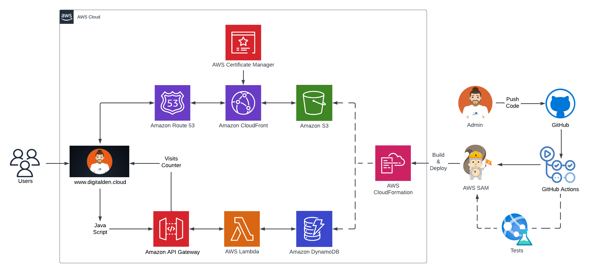
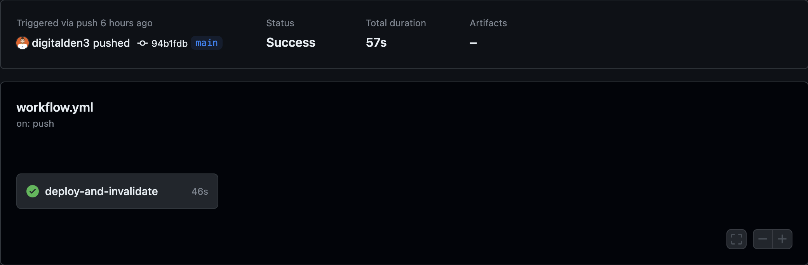

<br />

<p align="center">
  <a href="img/">
    
  </a>
  <h1 align="center">A Serverless Website</h1>
  <p align="center">
    This project was built on AWS and has a CI/CD pipeline on GitHub Actions workflow.
     <br />
    This is the front-end repo to the website:
    <br />
    https://digitalden.cloud
  </p>
</p>


</p>

<details open="open">
  <summary><h2 style="display: inline-block">Project Details</h2></summary>
  <ol>
    <li><a href="#tech-stack">Tech Stack</a>
    <li><a href="#project-date">Project Date</a></li>
    </li>
    <li><a href="#frontend-architecture">Frontend Architecture</a></li>
    <li><a href="#project-description">Project Description</a></li>
    <li><a href="#aws-sam-cli">AWS SAM CLI</a></li>  
    <li><a href="#cloudFront-distribution">CloudFront Distribution</a></li>  
    <li><a href="#html-and-css">HTML and CSS</a></li>    
    <li><a href="#static-s3-website">Static S3 Website </a></li>
    <li><a href="#route53-and-dns">Route53 and DNS </a></li>
    <li><a href="#https-and-acm">HTTPS and ACM </a></li>
    <li><a href="#github-actions">Github Actions</a></li>
    <li><a href="#room-for-growth">Room For Growth</a></li>
    <li><a href="#acknowledgements">Acknowledgements</a></li>
  </ol>
</details>

### Tech Stack
------------------
- HTML/CSS
- JavaScript
- AWS S3
- AWS CloudFront
- Route 53
- AWS Certificate Manager
- GitHub Actions

### Project date
------------------
- 16.04-2023 - Deployed by the Management Console
- TBA - Deployed by AWS SAM CLI

### Frontend Architecture
------------------


### Project Description
------------------
A simple, functional landing page that hosts multiple links that direct users to external websites. Webpage is written in HTML/JavaScript and is styled in CSS.

The webpage includes a visitor counter at the footer that displays how many people have accessed the webpage. There is a JavaScript code that makes this happen. More details about this can be found in the backend repository of this project, which can be found [HERE](https://github.com/digitalden3/serverless-website-backend).

Set up a web infrastructure on AWS that includes a registered domain at digitalden.cloud, routing traffic using Amazon Route 53, HTTPS protocol for website security, CloudFront distribution for caching website content, and Github Actions for CI/CD. D

omain registration gave a unique name for the website, which was then configured using Amazon Route 53 to route traffic to the domain. Secured the website with the HTTPS protocol, encrypting data between users' browsers and web server. Also set up a CloudFront distribution, which caches the website content at edge locations around the world for improved speed and reliability. 

Additionally, set up Github Actions for continuous integration and continuous deployment, which syncs code changes to an S3 bucket and invalidates the Cloudfront cache, ensuring that updated content is immediately available to users.

(The architecture was initially deployed by using the AWS Management Console, however I recently made a [dev branch](https://github.com/digitalden3/serverless-website-frontend/tree/dev) and automated this architecture with AWS SAM CLI. It is currently live on: https://denizyilmaz.cloud

Next steps: Merge this branch with main. Delete the infrastructure and then deploy the SAM template under digitalden.cloud.

### AWS SAM CLI
------------------
The SAM CLI is a command line tool that used with AWS SAM templates to build and run serverless applications. It adds functionality for building and testing Lambda applications. It uses Docker to run the functions in an Amazon Linux environment that matches Lambda. It can also emulate the application's build environment and API.

To use the SAM CLI, you need the following tools:

* SAM CLI: [Install the SAM CLI](https://docs.aws.amazon.com/serverless-application-model/latest/developerguide/serverless-sam-cli-install.html)
* Python 3: [Install Python 3](https://www.python.org/downloads/)
* Docker: [Install Docker](https://docs.aws.amazon.com/serverless-application-model/latest/developerguide/install-docker.html#install-docker-instructions)


#### Initializing the Project:

```bash
sam init
```

The sam init command initializes a new application project. To start with, select Python for the Lambda code and Hello World Example. The AWS SAM CLI downloads a starter template and creates a project folder directory structure. The stack includes an API Gateway, IAM Role and Lambda function.

#### Building the Application for Deployment:

```bash
sam build
```

The sam build command packages the function dependencies and organizes the project code and folder structure to prepare for deployment. The AWS SAM CLI creates a .aws-samdirectory and organizes the application dependencies and files there for deployment.

#### Deploying the Application:

```bash
sam deploy --guided
```

The sam deploy --guided command deploys the application through an interactive flow. The AWS SAM CLI guides you through configuring the application's deployment settings, transforming the template into AWS CloudFormation, and deploying to AWS CloudFormation to create the resources.

### HTML / CSS
------------------ 
Built a simple landing page that hosts multiple links. (LinkedIn, GitHub etc.) Webpage is written in HTML and styled in CSS. View the complete website files [HERE](website).

There is a snippet of JavaScript code in the webpage's footer section, which includes a "Visits" label above an AWS logo. The JavaScript retrieves the number of visits to the webpage by making a fetch call to the backend (an AWS Lambda API endpoint) that increments a counter and returns the current count. The count is then assigned to the "hits" span element using JavaScript:

```html
<!-- Footer -->
  <footer class="footer">
    <div style="text-align: center;">
      <span style="font-size: 20px;">Visits: <span id="hits"></span></span>
    </div>
    <div class="aws-logo">
      
    </div>
  </footer>
```

### Static S3 Website 
------------------
Created a Amazon S3 bucket and enabled bucket to host a static website. Pushed the index.html and stye.css (referenced in HTML) to the bucket using the aws s3 sync command. 

This template can be used to create an S3 bucket for hosting static websites:

```yaml
Resources:
  MyWebsite:
      Type: AWS::S3::Bucket
      Properties:
        AccessControl: PublicRead
        WebsiteConfiguration:
          IndexDocument: index.html
        BucketName: digitalden.cloud
```
The given code is a CloudFormation resource in YAML language that creates an S3 bucket with website hosting capability. The S3 bucket is configured to allow public read access and to serve index.html as the default document. The bucket name is set as digitalden.cloud.

Created an S3 bucket policy for the MyWebsite bucket resource:

```yaml
  BucketPolicy:
      Type: AWS::S3::BucketPolicy
      Properties:
        PolicyDocument:
          Id: WebPolicy
          Version: 2012-10-17
          Statement:
            - Sid: PublicReadForGetBucketObjects
              Effect: Allow
              Principal: "*"
              Action: "s3:GetObject"
              Resource: !Join
                - ""
                - - "arn:aws:s3:::"
                  - !Ref MyWebsite
                  - /*
        Bucket: !Ref MyWebsite
```
The policy allows public read access to objects in the bucket. The policy is defined using a PolicyDocument with a Statement that grants the s3:GetObject action to all principals ("*") for the MyWebsite bucket's objects.

Created a new directory in the repository called website and saved the HTML AND CSS files within. Pushed the files into the S3 Bucket:

```bash
aws s3 sync ./website s3://digitalden.cloud
```

### CloudFront Distribution
------------------
Deployed and configured a cloudfront distribution to attach the domain, digitalden.cloud name to the bucket. Created a resource that creates a CloudFront distribution that can be used to deliver static content from the S3 bucket to end-users with low latency and high transfer speeds.

```yaml
  MyDistribution:
    Type: "AWS::CloudFront::Distribution"
    Properties:
      DistributionConfig:
        DefaultCacheBehavior:
          ViewerProtocolPolicy: redirect-to-https
          TargetOriginId: digitalden.cloud.s3-website.eu-west-2.amazonaws.com
          DefaultTTL: 86400
          MinTTL: 1
          MaxTTL: 31536000
          ForwardedValues:
            QueryString: false
        Origins:
          - DomainName: digitalden.cloud.s3-website.eu-west-2.amazonaws.com
            Id: digitalden.cloud.s3-website.eu-west-2.amazonaws.com
            CustomOriginConfig:
              OriginProtocolPolicy: http-only
        Enabled: true
        DefaultRootObject: index.html
```
This resource creates an AWS CloudFront distribution with a configuration that redirects HTTP requests to HTTPS, which ensures that all traffic to digitalden.cloud is encrypted and that user data is protected. The resource has the digitalden.cloud S3 bucket set as the origin, which means that the S3 bucket is the source of the objects that the CloudFront distribution serves to clients.

The default TTL for objects in the CloudFront cache is set to 24 hours, and the minimum and maximum TTLs are set to 1 second and 1 year, respectively. If content is static and rarely changes, you may wish to set an even higher TTL value, such as 1 week or 1 month, depending on your specific requirements.

### Route53 and DNS 
------------------
Registered domain at digitalden.cloud. Configured Amazon Route 53 to route traffic to digitalden.cloud. Updated A Records to route traffic to CloudFront distribution.

```yaml
  MyRoute53Record:
    Type: "AWS::Route53::RecordSetGroup"
    Properties:
      HostedZoneId: Z03756231E8XL64ZEK4TA
      RecordSets:
        - Name: digitalden.cloud
          Type: A
          AliasTarget:
            HostedZoneId: Z2FDTNDATAQYW2
            DNSName: !GetAtt MyDistribution.DomainName
```

This is the CloudFormation resource that creates an Amazon Route 53 record set group. The record set group contains a single DNS record that maps the domain name digitalden.cloud to the CloudFront distribution. The AliasTarget property is used to create an alias record that routes traffic to the CloudFront distribution. The HostedZoneId and DNSName properties of the CloudFront distribution are specified using the !GetAtt function.

### HTTPS and ACM
------------------
Secured website using HTTPS protocol. Requested Public Certificates from AWS Certificate Manager. Attached certificate to CloudFront Distribution.

```yaml
  MyCertificate:
    Type: AWS::CertificateManager::Certificate
    Properties:
      DomainName: digitalden.cloud
      ValidationMethod: DNS
```
This resource creates an AWS Certificate Manager (ACM) certificate that will be issued for the domain digitalden.cloud. The validation method used to prove ownership of the domain will be DNS-based validation, which requires adding a specific DNS record to the domain's DNS configuration. After the certificate is issued and validated, it can be used to enable HTTPS connections for the CloudFront distribution. 

This resource associates the certificate with the CloudFront distribution:

```yaml
        ViewerCertificate:
          AcmCertificateArn: !Ref MyCertificate
          SslSupportMethod: sni-only
        Aliases:
          - denizyilmaz.cloud
```
This resource sets the SSL/TLS certificate to be used for HTTPS connections using the AWS Certificate Manager (ACM) certificate and specifies that only the SNI protocol should be used for SSL/TLS connections. It also associates the digitalden.cloud domain name with the CloudFront distribution.

### Github Actions
------------------
This project has a CI/CD pipeline on GitHub Actions workflow. It automates the deployment of files to an S3 bucket and the invalidation of the corresponding CloudFront distribution cache:
 
 ```bash
name: Workflow for S3 Deploy and Invalidate Cache
on: [push]

jobs:
  deploy-and-invalidate:
    runs-on: ubuntu-latest
    steps:
    - name: checkout
      uses: actions/checkout@master

    # Upload to S3
    - name: sync s3
      uses: jakejarvis/s3-sync-action@master
      with:
        args: --exclude '.git*/*' --delete --follow-symlinks
      env:
        SOURCE_DIR: './'
        AWS_REGION: 'eu-west-2'
        AWS_S3_BUCKET: ${{ secrets.AWS_S3_BUCKET }}
        AWS_ACCESS_KEY_ID: ${{ secrets.AWS_ACCESS_KEY_ID }}
        AWS_SECRET_ACCESS_KEY: ${{ secrets.AWS_SECRET_ACCESS_KEY }}

    # Invalidate Cloudfront
    - name: invalidate
      uses: chetan/invalidate-cloudfront-action@master
      env:
        DISTRIBUTION: ${{ secrets.CLOUDFRONT_DISTRIBUTION_ID }}
        PATHS: '/*'
        AWS_REGION: 'eu-west-2'
        AWS_ACCESS_KEY_ID: ${{ secrets.AWS_ACCESS_KEY_ID }}
        AWS_SECRET_ACCESS_KEY: ${{ secrets.AWS_SECRET_ACCESS_KEY }}
 ```

The workflow is triggered by a push event and consists of a single job. The job checks out the code, uploads the files to the specified S3 bucket, and invalidates the CloudFront cache.



 The AWS access key and secret access key are obtained from GitHub secrets and are stored in Github Action Secrets rather than in code for security.

### Room For Growth
------------------ 
This frontend was initially deployed using the management console. 
A dev branch was then created and this architecture was deployed using SAM CLI and the branch was merged with main.

### Acknowledgements
------------------
* [Cloud Resume Challenge](https://cloudresumechallenge.dev/)