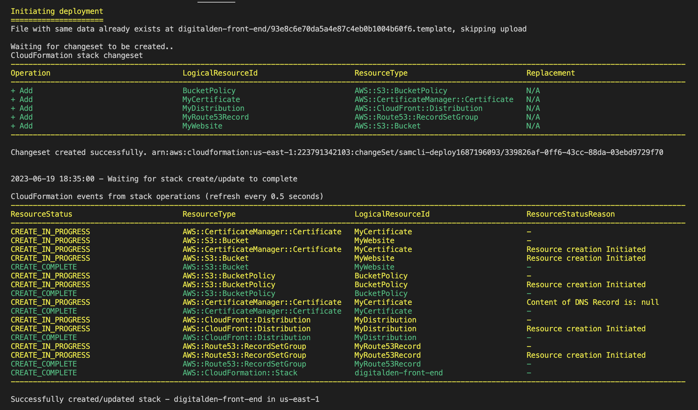

<br />


  <h1 align="center">A Serverless Website</h1>
  <p align="center">
  <br />
    Built on AWS using AWS SAM CLI for IaC and GitHub Actions for CI/CD.
     <br />
    This is the front-end repo to the website:
    <br />
    https://digitalden.cloud
  </p>
</p>


</p>

<details open="open">
  <summary><h2 style="display: inline-block">Project Details</h2></summary>
  <ol>
    <li><a href="#tech-stack">Tech Stack</a>
    <li><a href="#project-date">Project Date</a></li>
    </li>
    <li><a href="#frontend-architecture">Frontend Architecture</a></li>
    <li><a href="#project-description">Project Description</a></li>
    <li><a href="#infrastructure-migration">Infrastructure Migration </a></li>
    <li><a href="#aws-sam-cli">AWS SAM CLI</a></li>  
    <li><a href="#cloudFront-distribution">CloudFront Distribution</a></li>  
    <li><a href="#html-and-css">HTML and CSS</a></li>    
    <li><a href="#static-s3-website">Static S3 Website </a></li>
    <li><a href="#route53-and-dns">Route53 and DNS </a></li>
    <li><a href="#https-and-acm">HTTPS and ACM </a></li>
    <li><a href="#github-actions">Github Actions</a></li>
    <li><a href="#room-for-growth">Room For Growth</a></li>
    <li><a href="#acknowledgements">Acknowledgements</a></li>
  </ol>
</details>

### Tech Stack
------------------
- HTML/CSS
- JavaScript
- AWS S3
- AWS CloudFront
- Route 53
- AWS Certificate Manager
- GitHub Actions

### Project date
------------------
- 16.04.2023 - Deployed via Management Console
- 19.06.2023 - Deployed via AWS SAM CLI (IaC)

### Frontend Architecture
------------------


### Project Description
------------------
A simple, functional webpage that hosts multiple links that direct users to external websites. Webpage is written in HTML/JavaScript and is styled in CSS.

The webpage includes a site visitor counter at the footer that displays how many people have accessed the webpage. AWS API Gateway, Lambda Functions, DynamoDB and JavaScript code makes this happen. More details about this can be found in the backend repository of this project, which can be found [HERE](https://github.com/digitalden3/serverless-website-backend).

The frontend sets up a web infrastructure on AWS that includes a registered domain at digitalden.cloud, routing traffic using Amazon Route 53, HTTPS protocol for website security, CloudFront distribution for caching website content, and Github Actions for CI/CD. 

Domain registration gives a unique name for the webpage, which was then configured using Amazon Route 53 to route traffic to the domain. The webpage is secured with the HTTPS protocol, encrypting data between users' browsers and web server. A CloudFront distribution is configured, which caches the webpages content at edge locations around the world for improved speed and reliability. 

GitHub Actions is configured for continuous integration and continuous deployment, which syncs code changes to an S3 bucket and invalidates the Cloudfront cache, ensuring that updated content is immediately available to users.

### Infrastructure Migration
------------------
By following the steps below, I successfully migrated my infrastructure from the AWS Management Console's manual deployment to an Infrastructure as Code approach using AWS SAM. Additionally, I updated the YAML template to incorporate the necessary changes for the new security configuration of Amazon S3, ensuring that my buckets had the desired access control settings. Testing the changes on a separate domain allowed me to validate the updated configuration before applying it to your production environment.

**Initial Infrastructure Deployment:**<br>
* I initially deployed my infrastructure on AWS using the AWS Management Console. This involved manually configuring and provisioning all the necessary AWS resources for my serverless website.

**Infrastructure as Code Migration with AWS SAM:**<br>
* I transitioned my infrastructure to Infrastructure as Code, I decided to use AWS SAM. I created a new branch, named "dev," in my Git repository to work on the migration process. With AWS SAM CLI, I initialized a new AWS SAM project in the "dev" branch's directory. This step generated the project structure and necessary files for managing my infrastructure as code.

**YAML Template Creation:**<br>
* Using AWS SAM, I consolidated the required AWS resources and their configurations into a YAML template. This template acts as a blueprint for my infrastructure, defining the desired state of your AWS resources. The YAML template includes resource definitions such as an S3 Bucket, Route53 records, ACM Certificates, CloudFront Distribution and a Bucket Policy for my serverless website.
* I updated the YAML template by setting the "BlockPublicAcls" property to "false" for the S3 buckets. This was necessary due to a change in default security configuration by Amazon S3, starting from April 2023. Enabling this property ensured that S3 Block Public Access was disabled for the new buckets.

**Testing on a Separate Domain:**<br>
* Before merging the branches and applying the changes to my production environment, I tested the AWS SAM template on a separate domain, denizyilmaz.cloud. This allowed me to validate the functionality and ensure that the infrastructure was provisioned correctly.
* This also allowed me to verify that the infrastructure was provisioned correctly and that the "BlockPublicAcls" property was functioning as intended.

**Branch Merge and Cleanup:**<br>
* Once I was satisfied with the test deployment, I merged the "dev" branch, containing the AWS SAM changes, back into the main branch. This consolidated all the changes made during the migration process 

* I then deleted the infrastructure that was originally deployed through the AWS Management Console. This ensured a clean transition from the previous infrastructure to the new infrastructure defined by the AWS SAM template. However, due to the caching behavior of the CloudFront distribution associated with my website, my website remained accessible for a certain period of time. This was because CloudFront caches content for a specified Time-to-Live (TTL), and the TTL for my website was set to 24 hours.

**AWS SAM Deployment:**<br>
* With the changes merged and the old infrastructure removed, I proceeded to deploy the updated AWS SAM template using the AWS SAM CLI. This initiated the creation of the new infrastructure based on the YAML template, which included the necessary "BlockPublicAcls" property update.

**Website Deployment:**<br>
* After the AWS SAM deployment completed successfully, my serverless website became live under the domain specified in the AWS SAM template (in this case, "digitalden.cloud").

**Changing Bucket Region and Error:**<br>
* After deleting the original infrastructure, I attempted to create a new bucket in the "us-east-1" region with the same name as the previously deleted bucket.

* However, I encountered a "400 Bad Request" error. This error occurred due to a delay in propagating the availability of a bucket name across all regions. When you delete a bucket in one region, there is a delay before the name becomes available for use in all other regions. Therefore, attempting to create a bucket with the same name in a different region immediately after deletion resulted in this type of error.

* To resolve the error, I needed to wait for the bucket name to become available in the "us-east-1" region. Once the name was no longer associated with the deleted bucket, I could successfully create the bucket in the desired region.



### AWS SAM CLI
------------------
The SAM CLI is a command line tool that used with AWS SAM templates to build and run serverless applications. It adds functionality for building and testing Lambda applications. It uses Docker to run the functions in an Amazon Linux environment that matches Lambda. It can also emulate the application's build environment and API.

To use the SAM CLI, you need the following tools:

* SAM CLI: [Install the SAM CLI](https://docs.aws.amazon.com/serverless-application-model/latest/developerguide/serverless-sam-cli-install.html)
* Python 3: [Install Python 3](https://www.python.org/downloads/)
* Docker: [Install Docker](https://docs.aws.amazon.com/serverless-application-model/latest/developerguide/install-docker.html#install-docker-instructions)


#### Initializing the Project:

```bash
sam init
```

The sam init command initializes a new application project. To start with, select Python for the Lambda code and Hello World Example. The AWS SAM CLI downloads a starter template and creates a project folder directory structure. The stack includes an API Gateway, IAM Role and Lambda function.

#### Building the Application for Deployment:

```bash
sam build
```

The sam build command packages the function dependencies and organizes the project code and folder structure to prepare for deployment. The AWS SAM CLI creates a .aws-samdirectory and organizes the application dependencies and files there for deployment.

#### Deploying the Application:

```bash
sam deploy --guided
```

The sam deploy --guided command deploys the application through an interactive flow. The AWS SAM CLI guides you through configuring the application's deployment settings, transforming the template into AWS CloudFormation, and deploying to AWS CloudFormation to create the resources.

### HTML and CSS
------------------ 
Built a simple landing page that hosts multiple external links. (LinkedIn, GitHub etc.) Webpage is written in HTML and styled in CSS. View the complete website files [HERE](website).

There is a snippet of JavaScript code in the webpage's footer section, which includes a "Visits" label above an AWS logo. The JavaScript retrieves the number of visits to the webpage by making a fetch call to the backend (an AWS Lambda API endpoint) that increments a counter and returns the current count. The count is then assigned to the "hits" span element using JavaScript:

```html
<!-- Footer -->
  <footer class="footer">
    <div style="text-align: center;">
      <span style="font-size: 20px;">Visits: <span id="hits"></span></span>
    </div>
    <div class="aws-logo">
      
    </div>
  </footer>
```

### Static S3 Website 
------------------
Created a Amazon S3 bucket and enabled bucket to host a static website. Pushed the index.html and stye.css (referenced in HTML) to the bucket using the aws s3 sync command. 

This template can be used to create an S3 bucket for hosting static websites:

```yaml
Resources:
  MyWebsite:
      Type: AWS::S3::Bucket
      Properties:
        BucketName: digitalden.cloud
        ### No more AccessControl
        # AccessControl: PublicRead
        ###  replace it with...
        PublicAccessBlockConfiguration:
          BlockPublicAcls: false
        OwnershipControls:
          Rules:
            - ObjectOwnership: ObjectWriter
        WebsiteConfiguration:
          IndexDocument: index.html
```
The given code is a CloudFormation resource in YAML language that creates an S3 bucket with website hosting capability. The S3 bucket is configured to allow public read access and to serve index.html as the default document. The bucket name is set as digitalden.cloud.

Created an S3 bucket policy for the MyWebsite bucket resource:

```yaml
  BucketPolicy:
      Type: AWS::S3::BucketPolicy
      Properties:
        PolicyDocument:
          Id: WebPolicy
          Version: 2012-10-17
          Statement:
            - Sid: PublicReadForGetBucketObjects
              Effect: Allow
              Principal: "*"
              Action: "s3:GetObject"
              Resource: !Join
                - ""
                - - "arn:aws:s3:::"
                  - !Ref MyWebsite
                  - /*
        Bucket: !Ref MyWebsite
```
The policy allows public read access to objects in the bucket. The policy is defined using a PolicyDocument with a Statement that grants the s3:GetObject action to all principals ("*") for the MyWebsite bucket's objects.

Created a new directory in the repository called website and saved the HTML AND CSS files within. Pushed the files into the S3 Bucket:

```bash
aws s3 sync ./website s3://digitalden.cloud
```

### CloudFront Distribution
------------------
Deployed and configured a cloudfront distribution to attach the domain, digitalden.cloud name to the bucket. Created a resource that creates a CloudFront distribution that can be used to deliver static content from the S3 bucket to end-users with low latency and high transfer speeds.

```yaml
  MyDistribution:
    Type: "AWS::CloudFront::Distribution"
    Properties:
      DistributionConfig:
        DefaultCacheBehavior:
          ViewerProtocolPolicy: redirect-to-https
          TargetOriginId: digitalden.cloud.s3-website.eu-west-2.amazonaws.com
          DefaultTTL: 86400
          MinTTL: 1
          MaxTTL: 31536000
          ForwardedValues:
            QueryString: false
        Origins:
          - DomainName: digitalden.cloud.s3-website.eu-west-2.amazonaws.com
            Id: digitalden.cloud.s3-website.eu-west-2.amazonaws.com
            CustomOriginConfig:
              OriginProtocolPolicy: http-only
        Enabled: true
        DefaultRootObject: index.html
```
This resource creates an AWS CloudFront distribution with a configuration that redirects HTTP requests to HTTPS, which ensures that all traffic to digitalden.cloud is encrypted and that user data is protected. The resource has the digitalden.cloud S3 bucket set as the origin, which means that the S3 bucket is the source of the objects that the CloudFront distribution serves to clients.

The default TTL for objects in the CloudFront cache is set to 24 hours, and the minimum and maximum TTLs are set to 1 second and 1 year, respectively. If content is static and rarely changes, you may wish to set an even higher TTL value, such as 1 week or 1 month, depending on your specific requirements.

### Route53 and DNS 
------------------
Registered domain at digitalden.cloud. Configured Amazon Route 53 to route traffic to digitalden.cloud. Updated A Records to route traffic to CloudFront distribution.

```yaml
  MyRoute53Record:
    Type: "AWS::Route53::RecordSetGroup"
    Properties:
      HostedZoneId: Z03756231E8XL64ZEK4TA
      RecordSets:
        - Name: digitalden.cloud
          Type: A
          AliasTarget:
            HostedZoneId: Z2FDTNDATAQYW2
            DNSName: !GetAtt MyDistribution.DomainName
```

This is the CloudFormation resource that creates an Amazon Route 53 record set group. The record set group contains a single DNS record that maps the domain name digitalden.cloud to the CloudFront distribution. The AliasTarget property is used to create an alias record that routes traffic to the CloudFront distribution. The HostedZoneId and DNSName properties of the CloudFront distribution are specified using the !GetAtt function.

### HTTPS and ACM
------------------
Secured website using HTTPS protocol. Requested Public Certificates from AWS Certificate Manager. Attached certificate to CloudFront Distribution.

```yaml
  MyCertificate:
    Type: AWS::CertificateManager::Certificate
    Properties:
      DomainName: digitalden.cloud
      ValidationMethod: DNS
```
This resource creates an AWS Certificate Manager (ACM) certificate that will be issued for the domain digitalden.cloud. The validation method used to prove ownership of the domain will be DNS-based validation, which requires adding a specific DNS record to the domain's DNS configuration. After the certificate is issued and validated, it can be used to enable HTTPS connections for the CloudFront distribution. 

This resource associates the certificate with the CloudFront distribution:

```yaml
        ViewerCertificate:
          AcmCertificateArn: !Ref MyCertificate
          SslSupportMethod: sni-only
        Aliases:
          - digitalden.cloud
```
This resource sets the SSL/TLS certificate to be used for HTTPS connections using the AWS Certificate Manager (ACM) certificate and specifies that only the SNI protocol should be used for SSL/TLS connections. It also associates the digitalden.cloud domain name with the CloudFront distribution.

### Github Actions
------------------
This project has a CI/CD pipeline on GitHub Actions workflow. It automates the deployment of files to an S3 bucket and the invalidation of the corresponding CloudFront distribution cache:
 
 ```bash
name: Workflow for S3 Deploy and Invalidate Cache
on: [push]

jobs:
  deploy-and-invalidate:
    runs-on: ubuntu-latest
    steps:
    - name: checkout
      uses: actions/checkout@master

    # Upload to S3
    - name: sync s3
      uses: jakejarvis/s3-sync-action@master
      with:
        args: --exclude '.git*/*' --delete --follow-symlinks
      env:
        SOURCE_DIR: './'
        AWS_REGION: 'us-east-1'
        AWS_S3_BUCKET: ${{ secrets.AWS_S3_BUCKET }}
        AWS_ACCESS_KEY_ID: ${{ secrets.AWS_ACCESS_KEY_ID }}
        AWS_SECRET_ACCESS_KEY: ${{ secrets.AWS_SECRET_ACCESS_KEY }}

    # Invalidate Cloudfront
    - name: invalidate
      uses: chetan/invalidate-cloudfront-action@master
      env:
        DISTRIBUTION: ${{ secrets.CLOUDFRONT_DISTRIBUTION_ID }}
        PATHS: '/*'
        AWS_REGION: 'us-east-1'
        AWS_ACCESS_KEY_ID: ${{ secrets.AWS_ACCESS_KEY_ID }}
        AWS_SECRET_ACCESS_KEY: ${{ secrets.AWS_SECRET_ACCESS_KEY }}
 ```

The workflow is triggered by a push event and consists of a single job. The job checks out the code, uploads the files to the specified S3 bucket, and invalidates the CloudFront cache.


 The AWS access key and secret access key are obtained from GitHub secrets and are stored in Github Action Secrets rather than in code for security.

### Room For Growth
------------------ 
Deploy the Infrastructure via Terraform

### Acknowledgements
------------------
* [Cloud Resume Challenge](https://cloudresumechallenge.dev/)